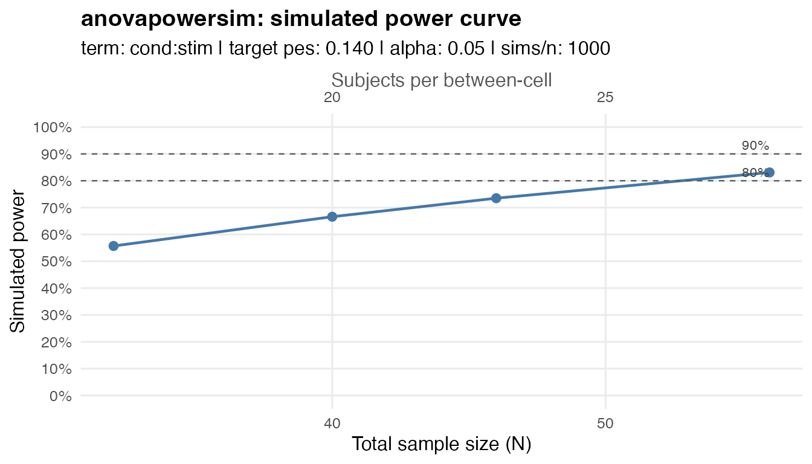

# Getting started with anovapowersim

`anovapowersim` simulates power for balanced factorial ANOVA designs.
Specify the factors/levels, the term of interest, and a target partial
eta squared. `anovapowersim` generates default term-specific cell means,
simulates datasets, refits the ANOVA with
[`stats::aov()`](https://rdrr.io/r/stats/aov.html), and estimates power.

``` r

library(anovapowersim)
```

## Search for the required sample size

The easiest way to get your required sample size is to use
[`power_n()`](https://shaheedazaad.github.io/anovapowersim/reference/power_n.md)
to search for the sample size needed to reach the requested `power`.

This example is a 2 x 2 mixed design with one between-subjects factor
(`cond`) and one within-subject factor (`stim`).

We specify that we are interested in the `cond:stim` interaction, and
that we want to have 90% power to detect a partial eta squared of 0.14.
[`power_n()`](https://shaheedazaad.github.io/anovapowersim/reference/power_n.md)
will search for the required sample size per between-subject cell, so
`n = 17` gives total `N = 34`.

``` r

power_n(
  between = c(cond = 2), # cond has 2 levels
  within = c(stim = 4), # stim has 4 levels
  term = "cond:stim",
  target_pes = 0.14,
  alpha = 0.05,
  power = 0.90,
  n_sims = 1000, # use 5000+ for a more precise estimate
  seed = 123 # for reproducibility
)
```

    #> <anovapowersim_curve>
    #>   term:          'cond:stim'
    #>   target power:  0.900
    #>   alpha:         0.05
    #>   effect size:   pes = 0.14
    #>   n values:      6 per-cell sample sizes visited
    #>   sims per cell size: 1000
    #>   SS type:       III
    #>   n needed for between-subjects cell: 17
    #>   total N needed: 34
    #> 
    #>  n_per_cell total_n n_sims num_df den_df    ncp power_calc power_sim
    #>          13      26   1000      3     72 11.721      0.808     0.795
    #>          16      32   1000      3     90 14.651      0.897     0.885
    #>          17      34   1000      3     96 15.628      0.917     0.912
    #>          18      36   1000      3    102 16.605      0.934     0.936
    #>          20      40   1000      3    114 18.558      0.958     0.946
    #>          26      52   1000      3    150 24.419      0.991     0.991

Note: here we use 1000 simulations for a quick example, but the package
defaults to 10000 simulations for more precise estimates.

The output table uses compact column names: `n_per_cell` is the sample
size per between-subject cell, `total_n` is the full sample size,
`num_df` and `den_df` are the ANOVA degrees of freedom, `ncp` is the
noncentrality parameter, `power_calc` is the noncentral F power
calculation, and `power_sim` is the simulation estimate.

### Adding factors and levels

You can add factors and levels as needed, and specify any term of
interest. For, example if we want to add a between condition with 3
levels, and we are interested in the 3-way interaction, we can do:

``` r

power_n(
  between = c(cond = 2, age = 3), # cond has 2 levels, age has 3 levels
  within = c(stim = 4), # stim has 4 levels
  term = "cond:stim:age",
  target_pes = 0.14,
  alpha = 0.05,
  power = 0.90,
  n_sims = 1000, # use 5000+ for a more precise estimate
  seed = 123 # for reproducibility
)
```

## Simulate a power curve

You might want to see how power changes across a range of sample sizes.
[`power_curve()`](https://shaheedazaad.github.io/anovapowersim/reference/power_curve.md)
simulates power across a range of sample sizes, which you can specify
with `n_range`. The result is a tidy data frame that you can plot with
[`plot_power_curve()`](https://shaheedazaad.github.io/anovapowersim/reference/plot_power_curve.md).

``` r

pc <- power_curve(
  between = c(cond = 2),
  within = c(stim = 2),
  term = "cond:stim",
  target_pes = 0.14,
  n_range = c(16, 20, 23, 28), # n per between-subject cell
  n_sims = 1000,
  seed = 123
)
pc
```

    #> <anovapowersim_curve>
    #>   term:          'cond:stim'
    #>   target power:  <not specified>
    #>   alpha:         0.05
    #>   effect size:   pes = 0.14
    #>   n values:      4 per-cell sample sizes visited
    #>   sims per cell size: 1000
    #>   SS type:       III
    #>   n needed for between-subjects cell: <not reached>
    #>   total N needed: <not reached>
    #> 
    #>  n_per_cell total_n n_sims num_df den_df   ncp power_calc power_sim
    #>          16      32   1000      1     30 4.884      0.571     0.557
    #>          20      40   1000      1     38 6.186      0.679     0.666
    #>          23      46   1000      1     44 7.163      0.745     0.735
    #>          28      56   1000      1     54 8.791      0.829     0.831

``` r

plot_power_curve(
  pc,
  power_lines = c(.80, .90) # adds horizontal lines at 80% and 90% power
)
```



## Advanced options

### Run simulations in parallel

For larger simulation runs, set `parallel = TRUE`. If you do not set
`cores`, `anovapowersim` uses one fewer than the number of available
cores and prints a message with the chosen count. Set `cores` explicitly
when you want a fixed number of cores.

``` r

power_curve(
  between = c(cond = 2),
  within = c(stim = 2),
  term = "cond:stim",
  target_pes = 0.14,
  n_range = c(16, 20, 23, 28),
  n_sims = 5000,
  parallel = TRUE,
  cores = 4,
  seed = 123
)
```

### Match the G\*Power convention

By default, `anovapowersim` calibrates the simulated cell means so the
empirical reference dataset has the requested partial eta squared under
the fitted [`stats::aov()`](https://rdrr.io/r/stats/aov.html) model.
This corresponds to the fitted ANOVA denominator-df noncentrality
convention.

Set `gpower = TRUE` when you want the G\*Power-style convention (when
using the ’as in Cohen (1988) option for within-subjects designs)
`lambda = total_n * f^2`.

``` r

power_n(
  between = c(cond = 2),
  within = c(stim = 4),
  term = "cond:stim",
  target_pes = 0.14,
  alpha = 0.05,
  power = 0.90,
  n_sims = 1000,
  seed = 123,
  gpower = TRUE
)
```

    #> <anovapowersim_curve>
    #>   term:          'cond:stim'
    #>   target power:  0.900
    #>   alpha:         0.05
    #>   effect size:   pes = 0.14
    #>   n values:      6 per-cell sample sizes visited
    #>   sims per cell size: 1000
    #>   G*Power convention: TRUE
    #>   SS type:       III
    #>   n needed for between-subjects cell: 45
    #>   total N needed: 90
    #> 
    #>  n_per_cell total_n n_sims num_df den_df    ncp power_calc power_sim
    #>          36      72   1000      3    210 11.721      0.823     0.829
    #>          44      88   1000      3    258 14.326      0.899     0.889
    #>          45      90   1000      3    264 14.651      0.906     0.907
    #>          47      94   1000      3    276 15.302      0.919     0.919
    #>          52     104   1000      3    306 16.930      0.944     0.936
    #>          72     144   1000      3    426 23.442      0.989     0.990
